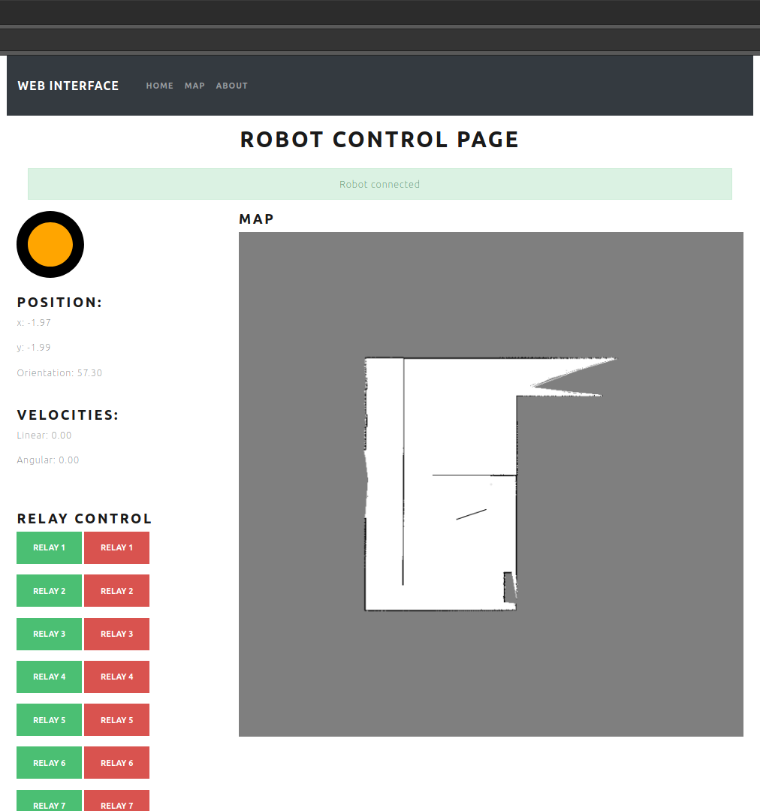

# Web Based Interface

### Environment

    Ubuntu version: 20.04
    Visual Stdio Code
    Broswer (Google, Firefox)

### Run
    roslaunch rosbridge_server rosbridge_websocket.launch 
    npm start

    

    

